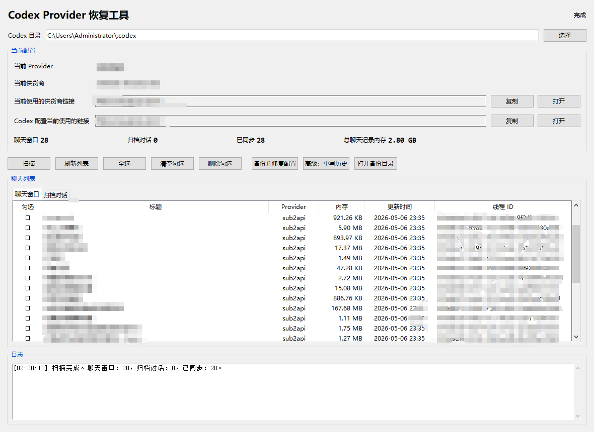

# Codex 对话恢复与清理工具

用于修复 Codex 在切换中转站、供应商或 `model_provider` 后，历史对话无法恢复、聊天窗口消失、打开旧对话报错的问题，并支持聊天清理与批量删除。



当前版本支持识别当前供应商链接、统计聊天记录内存、区分聊天窗口与归档对话，并提供安全备份后的清理与修复能力。

## 这个工具能做什么

- 自动识别当前正在使用的 Provider
- 自动识别当前供应商链接和 Codex 配置里实际使用的链接
- 扫描聊天窗口、归档对话、历史会话文件
- 显示聊天数量、已同步数量、总聊天记录内存
- 显示每条聊天记录对应的内存占用
- 支持单选、批量勾选删除聊天记录
- 删除前自动备份数据库、会话文件和配置
- 修复 `config.toml` 中缺失的历史 provider 映射
- 在需要时可高级重写历史记录中的 provider 名称

## 适用场景

- 切换中转站后，旧对话打不开
- 更换供应商后提示找不到 `model_provider`
- 聊天列表里还有记录，但点开报错
- 想批量清理聊天窗口或归档对话
- 想确认当前到底连的是哪个供应商地址

## 当前版本的修复思路

默认优先修复配置，而不是直接篡改历史记录。

这样做更稳：

- 旧聊天原始 provider 信息会尽量保留
- 只给当前配置补上兼容别名
- 后面再次切换供应商时，不容易把历史彻底改乱

如果你明确需要，也可以使用高级模式，把数据库和会话文件里的历史 provider 统一改成当前 provider。

## 主要功能说明

### 1. 扫描

扫描以下内容：

- `config.toml`
- `state_5.sqlite`
- `sessions`
- `archived_sessions`

会显示：

- 当前 Provider
- 当前供应商
- 当前供应商链接
- Codex 配置当前使用的链接
- 聊天窗口数量
- 归档对话数量
- 已同步数量
- 总聊天记录内存

### 2. 备份并修复配置

适合大多数“旧聊天打不开”的情况。

逻辑是：

1. 自动识别当前实际启用的供应商配置
2. 备份 `config.toml`
3. 将历史聊天里出现过、但当前配置缺失的 provider 名称补成兼容别名
4. 让这些历史 provider 指向当前可用的供应商配置

### 3. 高级重写历史

这个功能更激进，会直接修改：

- 数据库 `threads.model_provider`
- 会话文件首行 `session_meta.payload.model_provider`

只有在你确认需要统一历史 provider 时再使用。

### 4. 聊天管理

支持：

- 查看聊天窗口和归档对话
- 显示每条聊天记录内存
- 单个勾选
- 全选
- 清空勾选
- 批量删除

删除时会同步处理：

- 数据库记录
- `session_index.jsonl`
- 对应的会话文件

## 备份机制

程序会在当前目录下自动创建 `备份` 文件夹，并把修复或删除前的备份放进去。

这样做的好处是：

- 不依赖别人电脑里固定的路径
- 工具复制到哪里都能直接用
- 备份位置更直观，方便回滚

## 默认目录

默认扫描：

```text
C:\Users\Administrator\.codex
```

你也可以在界面里手动切换到其他 Codex 目录。

## 启动方式

双击下面任意一个文件即可：

- `start_provider_repair.bat`
- `启动恢复工具.bat`

## 环境与启动要求

- Windows 系统
- Python 3.8 及以上
- Tkinter

这个项目默认不依赖第三方 Python 包。

也就是说：

- 不需要执行 `pip install -r requirements.txt`
- 不需要额外安装 `requests`、`toml`、`pillow` 之类的包
- 只要 Python 自带标准库可用，并且带有 `Tkinter`，就可以直接运行

当前代码使用到的都是 Python 标准库：

- `datetime`
- `json`
- `os`
- `shutil`
- `sqlite3`
- `threading`
- `traceback`
- `uuid`
- `webbrowser`
- `tkinter`

注意：

- 这个工具不会自动安装 Python
- 也不会自动安装依赖环境
- 启动脚本只是执行 `python provider_repair_gui.py`
- 如果系统里没有 Python，或当前 Python 没带 `Tkinter`，程序就无法启动
- 如果你的 Python 缺少 `Tkinter`，程序会直接报错并退出

建议：

- 推荐安装 Python 3.10、3.11 或 3.12
- 安装 Python 时勾选 `Add Python to PATH`
- 安装完成后可在命令行执行 `python --version` 检查是否生效

## 文件说明

- `provider_repair_gui.py`：主程序
- `start_provider_repair.bat`：英文启动脚本
- `启动恢复工具.bat`：中文启动脚本
- `备份/`：运行后自动生成的备份目录
